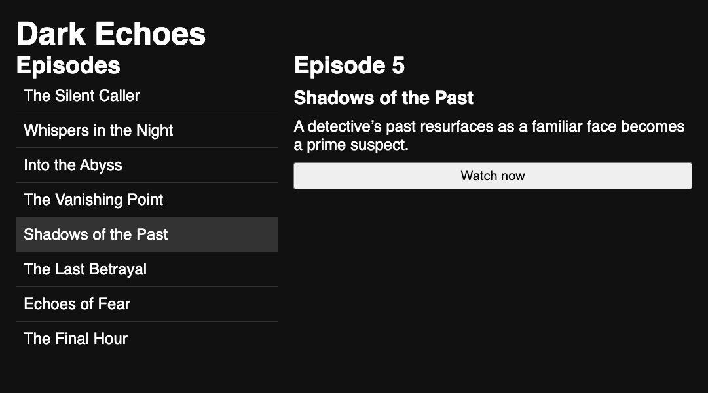

# Dark Echoes

Let's build a TV app with React! Users will be able to browse the episodes of a fictional TV series named _Dark Echoes_.

## Requirements

The boilerplate for setting up a React app with Vite has already been provided for you. You can start the app by running `npm install` and `npm run dev`.

Your task is to complete the `<App>` component in `src/App.jsx` to render the data that is exported from `src/data.js`. Your submission should meet the following requirements:

- The app imports the array from `data` into a state variable.
- The app keeps the selected episode in a state variable.
- A list of episode names is rendered.
- Each item in the rendered list has a unique key.
- When an episode in the list is clicked, the selected episode is updated in state.
- If no episode is selected, the app shows a message encouraging the user to select an episode.
- If there is a selected episode, the app displays more details about it, including the episode's number, name, and description.
- UI elements are organized into component functions.
- The app is styled with CSS.

## Submission

Please submit the link to your public GitHub repository.
